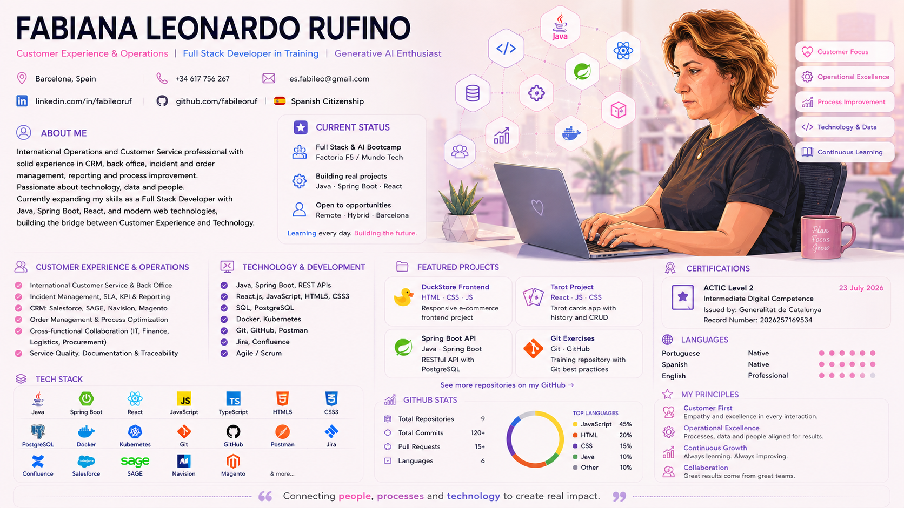

# Hi, I'm Fabiana 👋

  

  

---

## 🧠 About Me

💼 International Operations and Customer Service professional  

📊 Experience in Back Office, CRM, order management, reporting and process improvement  

🚀 Expanding my career into Full Stack Development and Generative AI  

💻 Building projects with Java, Spring Boot, React, JavaScript and PostgreSQL  

🌍 Based in Barcelona, Spain, with full European work authorization  

---

## 📚 Learning Journey

- 🌐 Frontend: HTML, CSS, JavaScript, React  
- 🎨 UX/UI: Figma, Stitch  
- ⚙️ Backend: Java, Spring Boot, REST APIs, Databases  
- 🗄️ Data: SQL, PostgreSQL  
- 🔐 Security: Authentication and JWT  
- 🧪 Testing: Unit Testing and TDD  
- 🐳 Infrastructure: Docker and Kubernetes fundamentals  
- 🔄 Agile: Scrum, Kanban, Gitflow, Jira and Trello  
- 🤖 AI: Generative AI and intelligent digital solutions  

🚀 Building real-world projects at Factoría F5 / Mundo Tech

---

## 🛠️ Tech Stack

  

### Business Platforms

`Salesforce` · `SAGE` · `Navision` · `Magento` · `Jira` · `Confluence`

---

## 📂 Projects

### 🟠 Duck Store Frontend

Responsive frontend project focused on interface development and web fundamentals.

[View repository](https://github.com/fabileoruf/duckstore-frontend)

### 🟣 Contemporary Goddesses Tarot

Collaborative project using React, Vite, Axios and CRUD operations.

### 🟢 Spring Boot API

REST API project developed with Java, Spring Boot and PostgreSQL.

### 🤖 AI Projects

Generative AI experiments and intelligent productivity solutions — coming soon.

---

## 🎓 Certifications

- ACTIC Level 2 — Intermediate Digital Competence
- Full Stack Development & AI Bootcamp — Factoría F5 / Mundo Tech
- Postgraduate Certificate in Digital Transformation — EAE Business School
- Digital Generation Program — EOI
- Customer Experience, Business & Marketing — TECH University

---

## 📊 GitHub Stats

## 📊 GitHub Activity

  

---

## 🌍 Languages

🇧🇷 Portuguese — Native  

🇪🇸 Spanish — Native  

🇺🇸 English — Professional  

---

## 📫 Connect with Me

  

  

---

  <strong>Connecting people, processes and technology to create real impact.</strong>

